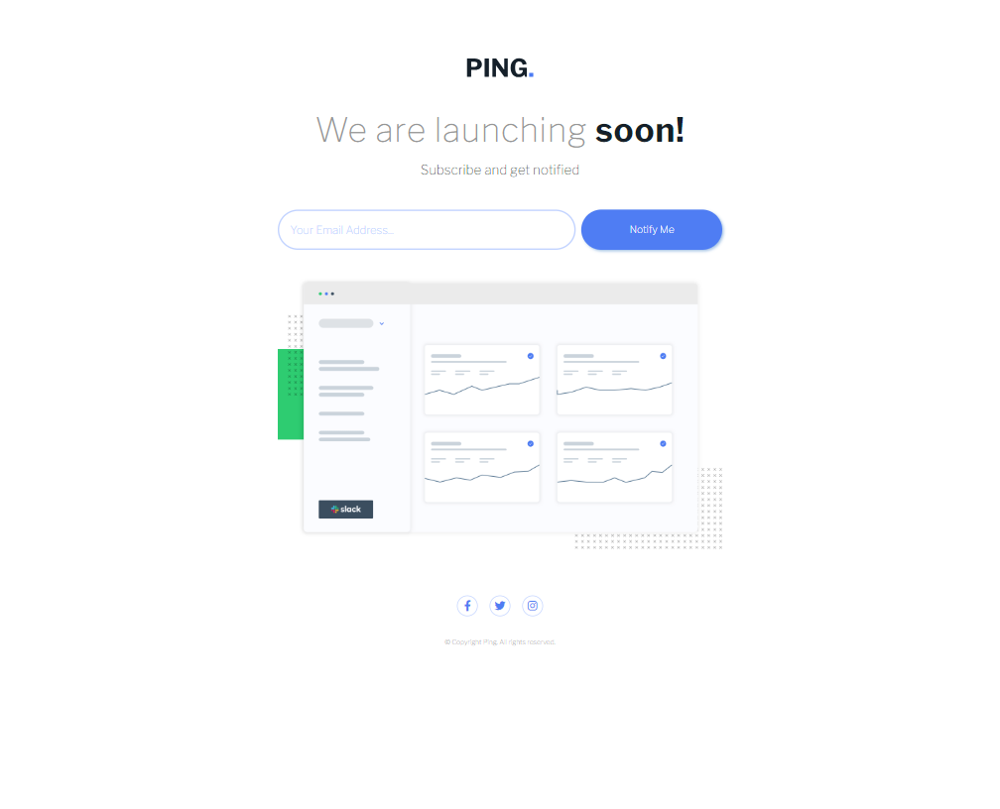

# Frontend Mentor - Ping coming soon page

.png>)

## Project Description

This project is a frontend development challenge based on the "Ping Single Column Coming Soon Page." The main goal of this challenge is to build a responsive single-column web page that serves as a "Coming Soon" landing page for a website. The page also includes an email validation form that provides real-time feedback for both email validation errors and successful submissions.

This challenge is an excellent opportunity to test your frontend development skills and perfect the precision in implementing designs.

## Features

- Responsive design that adapts to various screen sizes.
- Email validation form with real-time feedback to enhance the user experience.
- Change of input placeholder when there's an email validation error.
- Confirmation message upon successful form submission.
- Automatic clearing of input content after submission.

## Technologies Used 🛠️

-  Sass: CSS extension language with additional features.
   HTML5: Markup language for structuring the web page.
-  CSS3: Styling language for design and presentation.
   JavaScript: Programming language for interactivity and user interactions.

## Usage and Viewing

1. Clone this repository to your local machine.
2. Open the `index.html` file in your web browser.
3. Ensure that every detail, from spacing to colors, matches exactly with the original design.

## Customization

Feel free to customize this project or use it as a foundation for other challenges or personal projects:

- Modify CSS styles to align with your personal or branding preferences.
- Expand the project by adding more pages or components while upholding the same standard of design precision.

## Author ✒️

- **Carmenyo** - [Your GitHub Profile](https://github.com/carmenyo)

## Acknowledgments

I would like to express my gratitude to Frontend Mentor for providing engaging challenges that help enhance frontend development skills and attention to detail.
